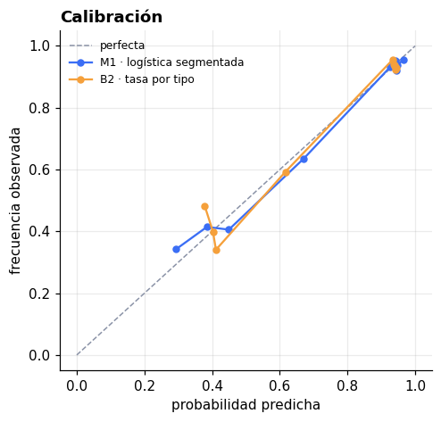

# 5. Evaluación

## El test, tocado una sola vez

11 eventos, 2.111 entradas, semanas ISO 30–31. El modelo se reentrenó con
train+val y se evaluó una vez.

| | MAE | IC 95% | MAPE | sesgo | AUC | ECE |
|---|---|---|---|---|---|---|
| **M1 · campeón** | **3.7** | [1.7, 6.3] | **4.4%** | +1.0 | 0.864 | 0.016 |
| B2 · tasa por tipo | 7.7 | [3.7, 12.0] | 12.5% | +2.5 | — | — |

**Comparación pareada en test: −3.95 personas por evento, IC 95%
[−7.17, −1.13]. El intervalo no cruza cero: aquí la ventaja sí se sostiene.**

### Por qué en test concluye y en desarrollo no

Dos razones, y conviene no confundirlas:

1. **La comparación pareada tiene más poder** que comparar dos intervalos
   sueltos. Los dos modelos vieron los mismos shows, así que se compara evento
   por evento en vez de tirar esa información.
2. **Es una única muestra de 11 eventos.** La lectura prudente es: la ventaja es
   real y del orden de 3–4 personas por evento, no que el modelo tenga
   exactamente 3.7 de error para siempre.

Se declara la limitación en vez de vender el 3.7 como si fuera una constante.

## Calibración

El ECE en test es 0.016: la probabilidad predicha coincide con la frecuencia
observada dentro de menos de 2 puntos por decil. Es la propiedad que hace
válido sumar probabilidades para obtener el aforo.

## Dónde falla

Error absoluto medio por entrada, en test:

| corte | grupo | n | error |
|---|---|---|---|
| tipo | pagada | 1.340 | **0.108** |
| tipo | **cortesía** | 771 | **0.446** |
| show | de gira | 921 | 0.219 |
| show | residencia | 1.190 | 0.242 |
| comprador | nuevo | 836 | 0.229 |
| comprador | en Boom | 1.275 | 0.234 |

**La cortesía concentra el error: 0.446 contra 0.108.** Cuatro veces más. Es
coherente con todo lo anterior — una entrada pagada es casi determinista y una
cortesía es una moneda cargada que depende de quién la tenga.

Consecuencias prácticas:

- Los shows con alta proporción de cortesías necesitan **intervalo más ancho**,
  y el simulador lo produce solo porque las probabilidades intermedias generan
  más varianza.
- El margen de mejora del modelo está casi todo ahí.

Los sesgos por segmento son pequeños (|sesgo| < 0.015 en todos los cortes): el
modelo no está sistemáticamente inclinado en ningún grupo.

## Los intervalos p10–p90

No salen de una fórmula cerrada sino de simular cada show 20.000 veces, con dos
fuentes de incertidumbre **separadas para no contarlas dos veces**:

| fuente | σ (logit) | qué es |
|---|---|---|
| azar de la puerta | 0.189 | cada entrada es una moneda; sumadas dan una Poisson-binomial |
| lo que el modelo no sabe | 0.161 | la noche del show: lluvia, un partido, el humor del acto |

El residuo total observado es 0.248, y `0.189² + 0.161² ≈ 0.248²`. La segunda se
obtiene **restando** la primera del residuo total: usar el residuo entero como
shock inflaría los intervalos, porque el azar de la puerta ya está dentro.

**Cobertura empírica: 81% de los eventos de julio caen dentro de su p10–p90**,
contra un objetivo de 80%.

### Una correlación que resultó no serlo

En julio, en el **11.3%** de las ventas de dos o más entradas no entró nadie.
Bajo independencia con la tasa media (74%) eso debería pasar el 4.7% de las
veces, lo que sugería que la gente llega en grupo y que hacía falta un término
de correlación intra-venta.

Con las probabilidades **individuales** del modelo, el valor esperado es
**11.5%** contra 11.3% observado. No había correlación que modelar: era
heterogeneidad que las variables ya explican. El cálculo ingenuo usaba la
probabilidad media y caía en la desigualdad de Jensen.

El simulador conserva el término de shock por venta, pero calibrado sobre los
datos vale 0.00 — el propio dato dice que no hace falta.

## Criterios de éxito del negocio

| criterio | meta | resultado |
|---|---|---|
| precisión | error < 10% | **4.4% de MAPE en test** ✓ |
| honestidad del rango | 8 de cada 10 | **81% de cobertura** ✓ |
| no inventar personas | — | 37.9% de ventas sin match, deliberadamente ✓ |
| utilidad operativa | responder sin abrir un notebook | skill + link de puerta ✓ |

## Riesgos y limitaciones

1. **32 eventos son pocos.** Todas las diferencias por debajo de ~2 personas por
   evento están dentro del ruido.
2. **Un solo mes de historia.** No hay estacionalidad ni efecto de festivos.
3. **Solo entradas ya adquiridas.** Los shows de fin de mes seguirán vendiendo;
   sus cifras no son el aforo final.
4. **Las palancas prescriptivas son observacionales.** Ver
   [`06-deployment.md`](06-deployment.md).
5. **Datos sintéticos.** Las relaciones son las que el generador puso; en datos
   reales habría que revalidar antes de confiar en las magnitudes.
